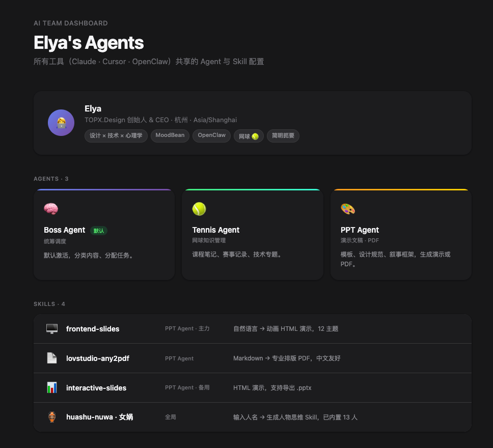

# Agent Hub

> 一个文件夹，让所有 AI 工具共享同一套 Agent 配置。

## 安装

```bash
npx skills add elya55/agent-hub
```

## 预览



## 解决什么问题

你在用 Claude、Cursor、OpenClaw……每个工具都要单独配置 Agent、用户信息、Skill。
Agent Hub 把这些集中在一个本地文件夹里，所有工具指向同一个地方。

## 创建的文件结构

```
~/agents/
├── AGENTS.md       ← 总纲，所有工具启动时首先读取
├── index.html      ← 可视化面板，浏览器打开查看
├── user/
│   └── USER.md     ← 你的信息
├── agents/
│   └── BOSS_SOUL.md← 默认 Boss Agent
└── skills/         ← 已安装的 Skills
```

## 使用方法

在任意支持 Skill 的 AI 工具中输入：

```
agent hub
```

或：

```
帮我创建 Agent Hub
```

AI 会引导你填写基本信息，自动生成所有文件，并配置好你使用的 LLM 工具。

## 支持的工具

- Claude Code（配置 `~/.claude/CLAUDE.md`）
- Cursor（配置 `.cursorrules`）
- OpenClaw（配置项目 `CLAUDE.md`）

## 设计理念

- **单一来源**：一处修改，所有工具生效
- **Boss 优先**：默认激活 Boss Agent 统筹，按需分配专项 Agent
- **渐进扩展**：从最小配置开始，按需添加
- **可视化**：index.html 让配置一目了然

## License

MIT
